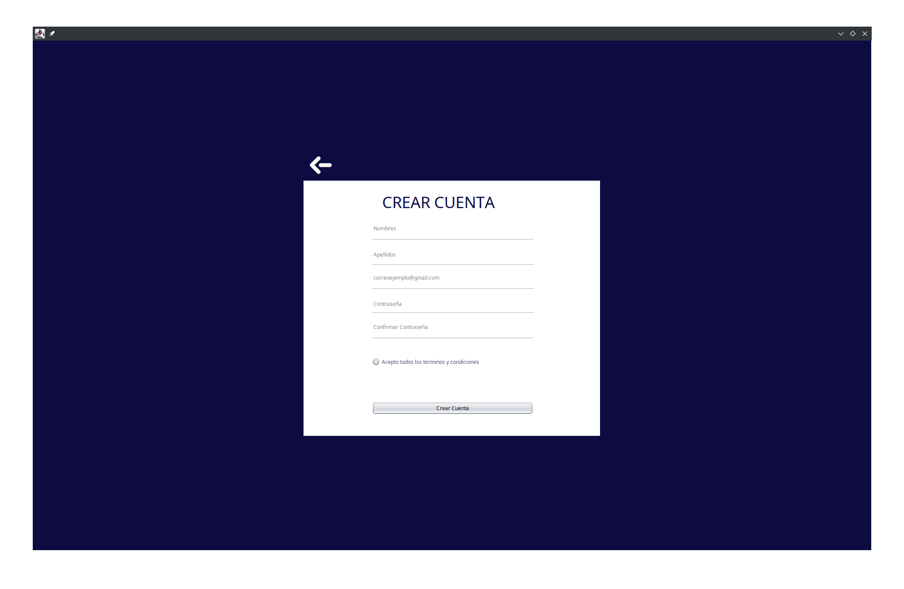
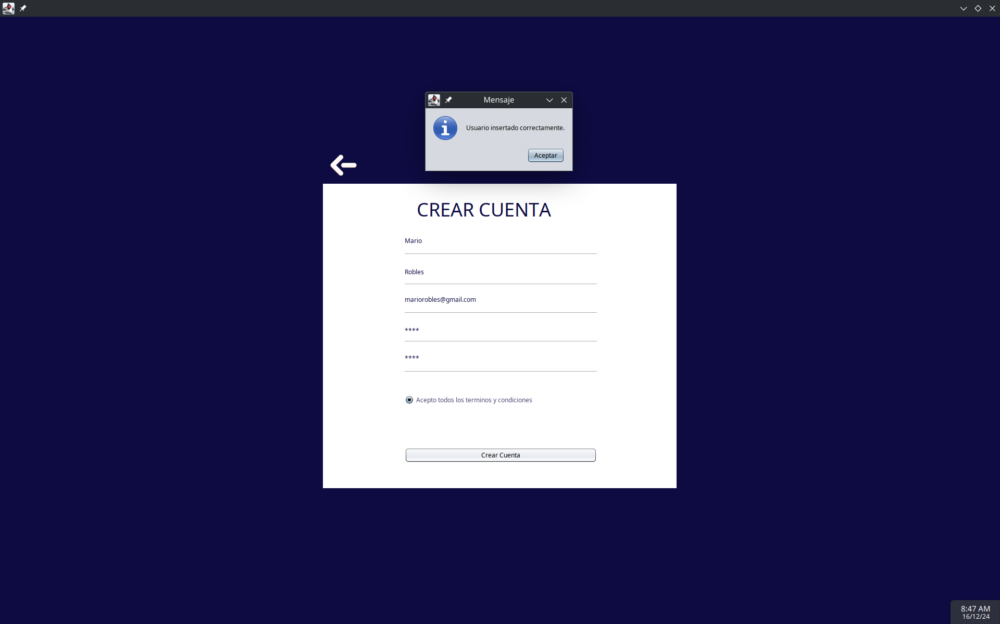
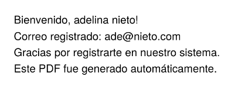
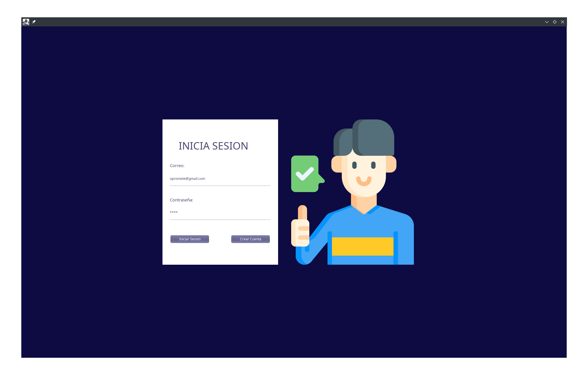
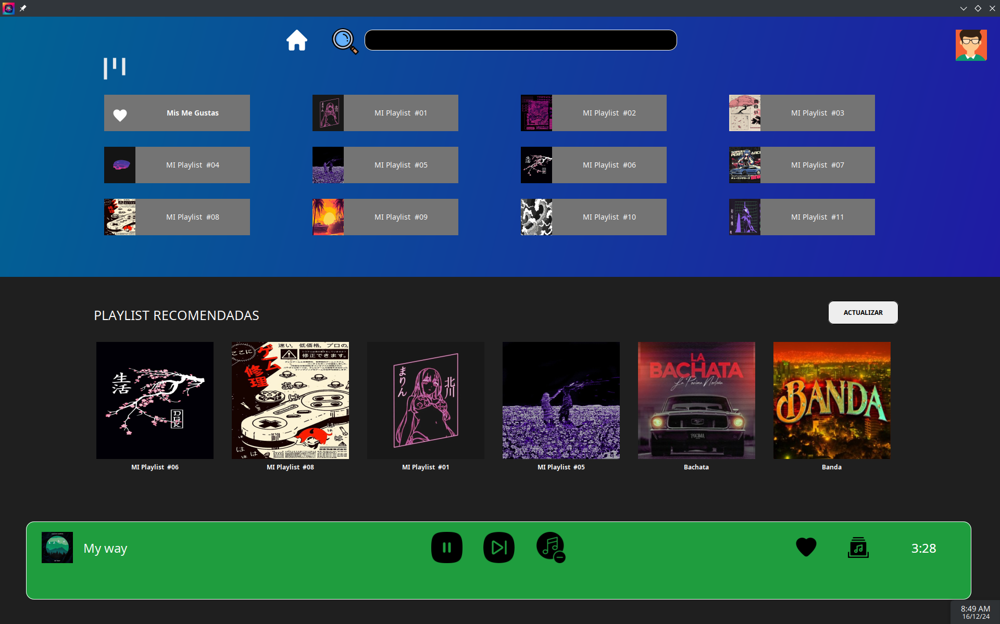
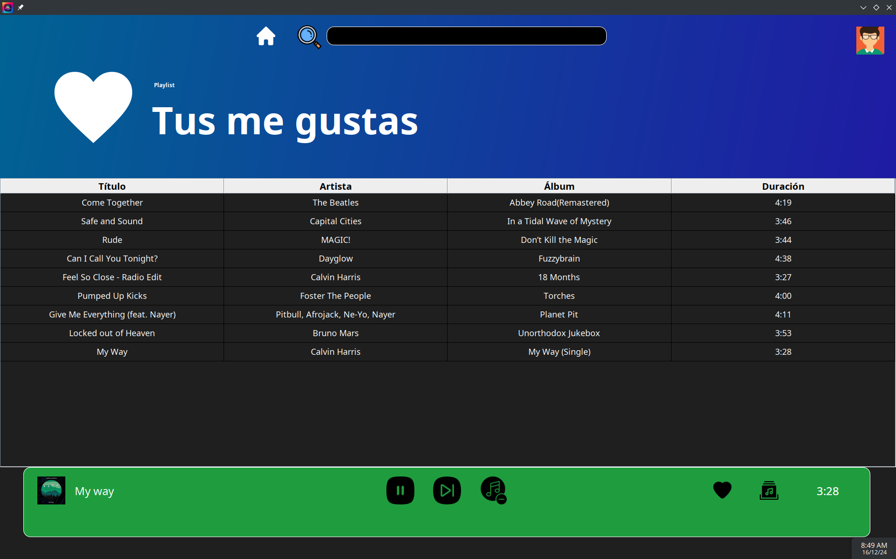
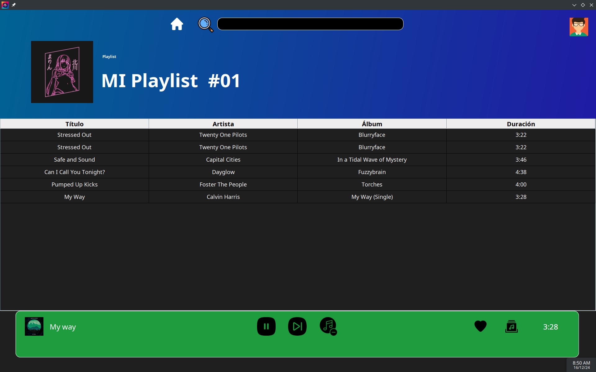
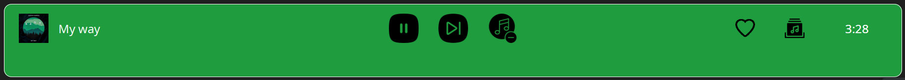
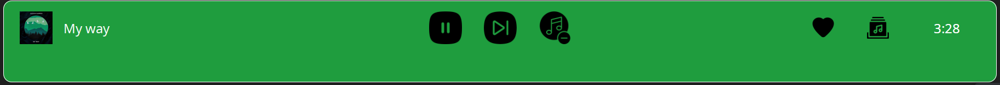

Aplicacion: sonidITO
El objetivo de esta apliacacion es hacer una aplicacion similar a una aplicación de
musica como lo es un Spotify pero de manera local o escalable a la nube , cuenta con un CRUD de administrador que tiene la capacidad agregar registros de 
en las canciones, usuario y editarlos prácticamente todo lo que con lleva un CRUD mientras que del lado del
usuario este cuenta con una ventana principal en la que podemos ver los me gustas de cada usuario  correspondiente
como una serie de playlist ya establecidas

---

EJECUCION DEL PROGRAMA

Crea tu cuenta con tus datos correspondientes

Confirmacion del usuario creado correctamente

Se crea un pdf

Confirmacion del usuario creado via pdf

Pantalla inicio sesion

Menu principal

Menu tus canciones favoritas

Alguna playlist seleccionada

Cancion no agregada a favoritos

Cancion agregada a favoritos

# Documentación de Métodos de Acceso a la Base de Datos

Este archivo describe los métodos utilizados para interactuar con la base de datos en un sistema de gestión de playlists y canciones.

---

## obtenerCancionesDePlaylist(int idPlaylist)
### Propósito
Obtiene todas las canciones asociadas a una playlist específica.

### Parámetros
- idPlaylist: Identificador único de la playlist.

### Retorno
- Una lista de objetos cancion que representan las canciones de la playlist.

### Funcionalidad
1. Realiza una consulta SQL con una unión entre las tablas playlist_cancion y cancion.
2. Procesa el resultado y construye una lista de objetos cancion.
3. Maneja excepciones SQL y retorna una lista vacía en caso de error.

---

## obtenerDetallesCancionPorNombre(String nombreCancion)
### Propósito
Recupera los detalles de una canción específica basada en su nombre.

### Parámetros
- nombreCancion: Nombre de la canción a buscar.

### Retorno
- Una lista de cadenas (List<String>) que contiene los detalles de la canción en el siguiente orden:
  1. ID de la canción
  2. Nombre
  3. Artista
  4. Álbum
  5. Duración
  6. Ruta de imagen
  7. Ruta de la canción
  8. Género

### Funcionalidad
- Realiza una consulta SQL para encontrar una canción cuyo nombre coincida.
- Si no se encuentra, retorna una lista vacía.

---

## obtenerDatosPlaylist(int idPlaylist)
### Propósito
Obtiene los datos básicos de una playlist específica.

### Parámetros
- idPlaylist: Identificador único de la playlist.

### Retorno
- Un arreglo de cadenas (String[]) con los datos:
  - ID de la playlist
  - Nombre de la playlist
  - Ruta de la imagen asociada

### Funcionalidad
- Consulta la tabla playlist_existente para obtener los datos de la playlist.
- Maneja errores y retorna null si ocurre algún problema.

---

## obtenerPlaylistUsuario(int idUsuario)
### Propósito
Obtiene todas las playlists asociadas a un usuario.

### Parámetros
- idUsuario: Identificador único del usuario.

### Retorno
- Una lista de arreglos de cadenas (List<String[]>), donde cada arreglo contiene:
  1. ID de la playlist
  2. Nombre de la playlist
  3. Ruta de la imagen

### Funcionalidad
- Realiza una consulta SQL para obtener las playlists relacionadas con el usuario.
- Retorna una lista vacía en caso de error.

---

## obtenerCancionesFavoritas(int id_usuario)
### Propósito
Obtiene las canciones marcadas como favoritas por un usuario.

### Parámetros
- id_usuario: Identificador único del usuario.

### Retorno
- Una lista de enteros (List<Integer>) que contiene los IDs de las canciones favoritas.

### Funcionalidad
- Consulta la tabla favoritosusuario para obtener las canciones favoritas de un usuario.
- Maneja excepciones SQL y retorna una lista vacía si ocurre algún problema.

---

## obtenerDetallesCancionesFavoritas(List<Integer> idsCanciones)
### Propósito
Obtiene los detalles completos de un conjunto de canciones favoritas.

### Parámetros
- idsCanciones: Una lista de IDs de canciones.

### Retorno
- Una lista de objetos cancion con los detalles de las canciones.

### Funcionalidad
- Construye una consulta dinámica utilizando IN (?, ?, ...) para buscar múltiples canciones.
- Procesa los resultados y los convierte en objetos cancion.

---

## existeFav(int id_usuario, int id_cancion)
### Propósito
Verifica si una canción está marcada como favorita por un usuario.

### Parámetros
- id_usuario: Identificador del usuario.
- id_cancion: Identificador de la canción.

### Retorno
- true si la canción está marcada como favorita, false de lo contrario.

### Funcionalidad
- Realiza una consulta SQL que retorna true si existe un registro que coincide.

---

## insertarFav(int id_usuario, int id_cancion)
### Propósito
Inserta una canción en la lista de favoritos de un usuario.

### Parámetros
- id_usuario: Identificador del usuario.
- id_cancion: Identificador de la canción.

### Retorno
- true si la inserción fue exitosa, false en caso de error.

### Funcionalidad
- Ejecuta un comando INSERT para agregar el registro en la tabla favoritosusuario.

---

## eliminarFav(int id_usuario, int id_cancion)
### Propósito
Elimina una canción de los favoritos de un usuario.

### Parámetros
- id_usuario: Identificador del usuario.
- id_cancion: Identificador de la canción.

### Retorno
- true si la eliminación fue exitosa, false en caso de error.

### Funcionalidad
- Ejecuta un comando DELETE para eliminar el registro en la tabla favoritosusuario.

---

## obtenerPlaylistExistentes()
### Propósito
Obtiene todas las playlists disponibles en el sistema.

### Retorno
- Una lista de arreglos de cadenas (List<String[]>), donde cada arreglo contiene:
  1. ID de la playlist
  2. Nombre de la playlist
  3. Ruta de la imagen
  4. Descripción

### Documentación de la interfaz  
La interfaz de este programa cuenta con un total de 7 paginas aproximadamente contando el main en las que se incluye toda la gestión del 
programa desde la creación de usuarios desde la vista del administrador\usuario hasta la reproducción de musica
Inicio de sesion este es capaz de determinar si es administrador o usuario y redirigirlos a su propias ventanas

Crear Uusario desde la vista del usuario el sistema le da la opcion a el usuario a crear un nuevo usuario eso si no puede eleguir si es administrador o usuario

Menu Administrador

Este menu cuenta con 5 botones cada uno con su propia funcionalidad

Insercion de datos
 

Edicion de Registros
 

Cada edicion de registros teniendo sus popios botones para eliminar, actualizar y refrescar contando tambien con una barra de bussqueda

