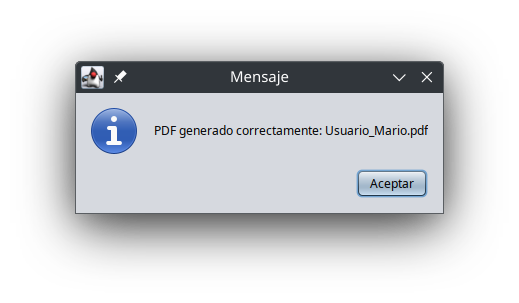

Application: sonidITO

# Features 

## User Interface : 
Similar to Spotify, with a clean and intuitive design.

## Admin CRUD : 
Allows administrators to add, edit, and manage songs, users, and playlists.

## User Experience :

View personalized "Likes" (songs the user has marked as favorites).

Access pre-defined playlists.

Explore recommended playlists based on user prefererences.

# Technologies Used 

Programming Language : Java

Database : MySQL

Design : User-friendly interface inspired by Spotify.
    
---

PROGRAM EXECUTION
  
Create your account with your corresponding details  

  
Confirmation of successfully created user  

  
A PDF is generated  

  
User creation confirmation via PDF  

  
Login screen  

  
Main menu  

  
Your favorite songs menu  

  
Selected playlist  

  
Song not added to favorites  

  
Song added to favorites  

# Database Access Methods Documentation

This file describes the methods used to interact with the database in a playlist and song management system.

---

## obtenerCancionesDePlaylist(int idPlaylist)  
### Purpose  
Retrieves all songs associated with a specific playlist.  

### Parameters  
- idPlaylist: Unique identifier of the playlist.  

### Return  
- A list of song objects representing the playlist's songs.  

### Functionality  
1. Executes an SQL query joining the playlist_song and song tables.  
2. Processes the result and builds a list of song objects.  
3. Handles SQL exceptions and returns an empty list in case of error.  

---

## obtenerDetallesCancionPorNombre(String nombreCancion)  
### Purpose  
Retrieves the details of a specific song based on its name.  

### Parameters  
- nombreCancion: Name of the song to search for.  

### Return  
- A string list (List<String>) containing the song details in the following order:  
  1. Song ID  
  2. Name  
  3. Artist  
  4. Album  
  5. Duration  
  6. Image path  
  7. Song path  
  8. Genre  

### Functionality  
- Performs an SQL query to find a song with a matching name.  
- Returns an empty list if not found.  
---
## obtenerDatosPlaylist(int idPlaylist)  
### Purpose  
Retrieves basic data of a specific playlist.  

### Parameters  
- idPlaylist: Unique identifier of the playlist.  

### Return  
- A string array (String[]) containing:  
  - Playlist ID  
  - Playlist name  
  - Associated image path  

### Functionality  
- Queries the playlist_existente table to get playlist data.  
- Handles errors and returns null if any issues occur.  

---

## obtenerPlaylistUsuario(int idUsuario)  
### Purpose  
Gets all playlists associated with a user.  

### Parameters  
- idUsuario: Unique user identifier.  

### Return  
- A list of string arrays (List<String[]>), where each array contains:  
  1. Playlist ID  
  2. Playlist name  
  3. Image path  

### Functionality  
- Performs an SQL query to get user-related playlists.  
- Returns an empty list in case of error.  

---

## obtenerCancionesFavoritas(int id_usuario)  
### Purpose  
Retrieves songs marked as favorites by a user.  

### Parameters  
- id_usuario: Unique user identifier.  

### Return  
- A list of integers (List<Integer>) containing favorite song IDs.  

### Functionality  
- Queries the favoritosusuario table for a user's favorite songs.  
- Handles SQL exceptions and returns an empty list if any issues occur.  

---

## obtenerDetallesCancionesFavoritas(List<Integer> idsCanciones)  
### Purpose  
Gets complete details of a set of favorite songs.  

### Parameters  
- idsCanciones: List of song IDs.  

### Return  
- A list of song objects with song details.  

### Functionality  
- Builds a dynamic query using IN (?, ?, ...) to search multiple songs.  
- Processes results and converts them into song objects.  

---

## existeFav(int id_usuario, int id_cancion)  
### Purpose  
Checks if a song is marked as favorite by a user.  

### Parameters  
- id_usuario: User identifier.  
- id_cancion: Song identifier.  

### Return  
- true if the song is marked as favorite, false otherwise.  

### Functionality  
- Executes an SQL query that returns true if a matching record exists.  

---
## insertarFav(int id_usuario, int id_cancion)
### Purpose
Adds a song to a user's favorites list.

### Parameters
- id_usuario: User identifier
- id_cancion: Song identifier

### Return
- true if insertion was successful, false on error

### Functionality
- Executes an INSERT command to add the record to the favoritosusuario table

---

## eliminarFav(int id_usuario, int id_cancion)
### Purpose
Removes a song from a user's favorites

### Parameters
- id_usuario: User identifier
- id_cancion: Song identifier

### Return
- true if deletion was successful, false on error

### Functionality
- Executes a DELETE command to remove the record from favoritosusuario table

---

## obtenerPlaylistExistentes()
### Purpose
Gets all available playlists in the system

### Return
- A list of string arrays (List<String[]>), where each array contains:
  1. Playlist ID
  2. Playlist name
  3. Image path
  4. Description

### Interface Documentation
The program interface consists of approximately 7 pages (including main) that cover all program management from user creation (admin/user view) to music playback.

Login screen - can determine if user is admin or regular user and redirect accordingly

User creation from user view - system allows user to create new account (cannot choose admin/user role)

Admin menu

This menu has 5 buttons, each with specific functionality

Data insertion
 

